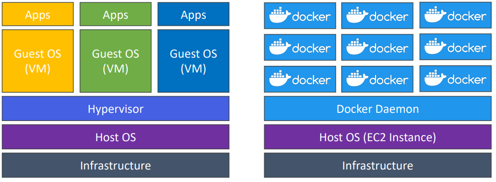
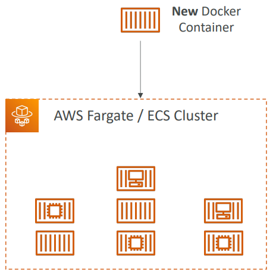

# ECS, ECR & Fargate - Docker in AWS

## Contents

-   [1. What is Docker?](#1-what-is-docker)
    -   [1.1. Where are Docker images stored?](#11-where-are-docker-images-stored)
    -   [1.2. Docker vs. Virtual Machines](#12-docker-vs-virtual-machines)
    -   [1.3. Getting Started with Docker](#13-getting-started-with-docker)
    -   [1.4. Docker Containers Management on AWS](#14-docker-containers-management-on-aws)
-   [2. ECS](#2-ecs)
    -   [2.1 Launch Type](#21-launch-type)
        -   [2.1.1. EC2 Launch Type](#211-ec2-launch-type)
        -   [2.1.2. Fargate Launch Type](#212-fargate-launch-type)
    -   [2.2. IAM Roles for ECS](#22-iam-roles-for-ecs)
    -   [2.3. Load Balancer Integrations](#23-load-balancer-integrations)
    -   [2.4. Data Volumes (EFS)](#24-data-volumes-efs)

# 1. What is Docker?

-   Docker is a software development platform to **deploy apps**
-   Apps are packaged in containers that can be run on **any** OS
-   Apps run the same, regardless of where they’re run
    -   Any machine
    -   No compatibility issues
    -   Predictable behavior
    -   Less work
    -   Easier to maintain and deploy
    -   Works with any language, any OS, any technology
-   Use cases: microservices architecture, lift-and-shift apps from on-premises to the AWS cloud, …

## 1.1. Where are Docker images stored?

-   Docker images are stored in **Docker Repositories**
-   Docker Hub (https://hub.docker.com)
    -   Public repository
    -   Find base images for many technologies or OS (e.g., Ubuntu, MySQL, …)
-   Amazon ECR (Amazon Elastic Container Registry)
    -   Private repository
    -   Public repository (Amazon ECR Public Gallery https://gallery.ecr.aws)

## 1.2. Docker vs. Virtual Machines

-   Docker is ”sort of” a virtualization technology, but not exactly
-   Resources are shared with the host => many containers on one server

## 1.3. Getting Started with Docker

## 1.4. Docker Containers Management on AWS

-   **Amazon Elastic Container Service (Amazon ECS):**
    -   Amazon's own container platform.
-   **Amazon Elastic Kubernetes Service (Amazon EKS):**
    -   Amazon's managed Kubernetes (open source).
-   **AWS Fargate:**
    -   Amazon's own Serverless container platform.
    -   Works with ECS and with EKS.
-   **Amazon Elastic Container Registry (Amazon ECR):**

    -   Store container images.

    # 2. ECS

    ## 2.1. Launch Type

    ### 2.1.1. EC2 Launch Type

-   ECS = Elastic Container Service
-   Launch Docker containers on AWS = Launch **ECS Tasks** on ECS Clusters
-   **EC2 Launch Type: you must provision & maintain the infrSastructure (the EC2
    instances)**
-   Each EC2 Instance must run the ECS Agent to register in the ECS Cluster
-   AWS takes care of starting / stopping containers

    

    ### 2.1.2. Fargate Launch Type

-   Launch Docker containers on AWS
-   **You do not provision the infrastructure (no EC2 instances to manage)**
-   **It’s all Serverless!**
-   You just create task definitions
-   AWS just runs ECS Tasks for you based on the CPU / RAM you need
-   To scale, just increase the number of tasks. Simple - no more EC2 instances

      

## 2.2. IAM Roles for ECS

-   **EC2 Instance Profile (EC2 Launch Type only):**
    -   Used by the _ECS agent_
    -   Makes API calls to ECS service
    -   Send container logs to CloudWatch Logs
    -   Pull Docker image from ECR
    -   Reference sensitive data in Secrets Manager or SSM Parameter Store
-   **ECS Task Role:**

    -   Allows each task to have a specific role
    -   Use different roles for the different ECS Services you run
    -   Task Role is defined in the **task definition**

      

## 2.3. Load Balancer Integrations

-   **Application Load Balancer** supported and works for most use cases
-   **Network Load Balancer** recommended only for high throughput / high performance use cases, or to pair it with AWS Private Link
-   **_Elastic Load Balancer_** supported but not recommended (no advanced features – no Fargate)

    

## 2.4. Data Volumes (EFS)

-   Mount EFS file systems onto ECS tasks
-   Works for both **EC2** and **Fargate** launch types
-   Tasks running in any AZ will share the same data in the EFS file system
-   **Fargate + EFS = Serverless**
-   Use cases: persistent multi-AZ shared storage for your containers
-   **Note:** Amazon S3 cannot be mounted as a file system

    
